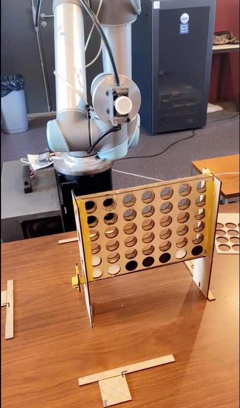

<h1>Projet Puissance 4</h1>

__Projet:__

    -Le but de ce projet est de réaliser un jeu puissance 4 sur client graphique, et d'en exécuter du contrôle-commande physiquement via un cobot.

    -Ces contrôles sont entre autres l'insertion de pion dans des colonnes du plateau et le retrait des pions en fin de partie.

.jpg)

## 1. Sources

Code decoupe laser : [Lien](https://www.youtube.com/watch?v=vofsQDXO5eM/)

Code impression 3D : [Lien](https://www.thingiverse.com/thing:3294699/)

## 2. Logiciel utilisés

Gestion de projet: GitLab 
Scrum: Users stories (10) | Daily (5) | Sprint (2) [ Branches (Integration & Master) 

Programmation interface graphique: C# (Visual Studio)

Programation de cobot: Urscript (URSim)

## 3. Matériels utilisés

cobot UR, imprimante 3D , découpe laser, plateau et jetons de jeu , ordinateur portable.

## 4. Travail à effectuer

    1. Installation du URsim.
    2. Une interface graphique en C#, présentant :
        a. 
    3. Enregistrer les positions de chaque colonnes de jeu.
        a. intégrer à l'interface graphique la simulation de cobot.
   
  
## 5. Installation

Récupérer les codes sources sur la branche Integration:
    

## 6. Vidéos:

## 7. Conclusion

__Fonctionel:__

    - Création de l'interface graphique du jeu puissance 4
    - Connexion jeu avec - cobot
    - Exécution de contrôle depuis le jeu
    - Insertion des pions dans une colonne par le cobot (suite à une instruction)
    - Retrait de la planche de maintien des pions par le robot en fin de partie

